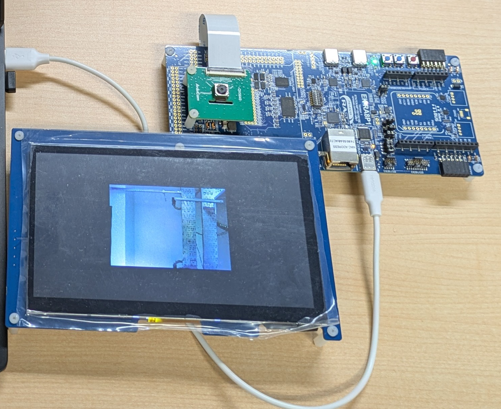

# RA8P1 Vision Walking Assist

EK-RA8P1とμT-Kernel 3.0による、歩行支援向け視覚処理の試作システムです。カメラまたはUSB動画から動きと物体を解析し、LCD・LED・シリアルコンソールに表示します。

特徴は、動き解析とYOLOX-Tinyによる物体認識を異なる優先度のタスクで動かし、CPU1で方向提示を行う構成です。方向提示は動きの活動量に基づくデモ用判定で、人体への電気刺激・音声出力は対象外です。



評価機のカメラ・LCD接続と映像表示。写真は機器部分を切り出しています。

```text
カメラ / USB動画 → CPU0：動き解析 + YOLOX-Tiny → LCD
                                ↓ IPC snapshot
                     CPU1：方向・危険度 → LED / コンソール
```

## 資料

- [実行・評価手順](docs/RUN_AND_EVALUATE.md)：環境、ビルド、Debug→RESET、表示の読み方。
- [ファームウェアの独自実装と原版との差分](docs/FIRMWARE_CHANGES.md)：タスク構成、BSP/FSP・モデル統合の変更。
- [第三者ソフトウェア](docs/THIRD_PARTY_SOFTWARE.md)：利用箇所、入手先、ライセンス。

## プロジェクト

`firmware/evaluations/` の次の3プロジェクトを同じ相対配置で使用します。

| プロジェクト | 担当 |
| --- | --- |
| [mtkernel_test7_dualCoreIpc](firmware/evaluations/mtkernel_test7_dualCoreIpc/) | CPU0：入力、動き解析、物体認識、LCD、IPC送信 |
| [mtkernel_test7_dualCoreIpc_CPU1](firmware/evaluations/mtkernel_test7_dualCoreIpc_CPU1/) | CPU1：IPC受信、方向・危険度判定、LED、コンソール |
| [mtkernel_test7_dualCoreIpc_Solution](firmware/evaluations/mtkernel_test7_dualCoreIpc_Solution/) | 両CPUのビルド構成と共通設定 |

初期設定はカメラ入力・Display ONです。同梱の生成済みソース、OS/BSP、モデルを使用し、FSP再生成やモデル再変換を行わずにビルドします。

動作確認済みコードの基準は `baseline-verified-v1`（`36d0c5eaec646596231edf4f8f1b180e797f5732`）。[実機確認記録](docs/evidence/baseline-verification.md)に対象と手順を示します。READMEとdocsはこのコード基準タグとは別に管理する説明資料です。

提出物の対応は[提出物一覧](docs/SUBMISSION_CHECKLIST.md)を参照してください。各第三者ソフトウェアのライセンスと著作権表示は、それぞれのファイルに適用されます。
