# 実行・評価手順

コード基準：`baseline-verified-v1`（`36d0c5eaec646596231edf4f8f1b180e797f5732`）。本手順は設定済みEK-RA8P1評価機を用いた、Debug起動→ボードRESETによる評価手順です。2026-09-28の操作画面・ビルドログと対象作業ツリーを[実機確認記録](evidence/baseline-verification.md)に示します。

## 1. 環境と接続

| 項目 | 使用構成 |
| --- | --- |
| ボード・OS | Renesas EK-RA8P1、μT-Kernel 3.0 + BSP2 |
| 開発環境 | Windows、e² studio 2026-04.2、GCC for Arm 13.2.1 |
| FSP | 同梱ソース6.5.1。IDEのインストールフォルダ名に含まれる6.5.0とは区別する |
| カメラ入力 | EK-RA8P1開発キット同梱のOV5640 MIPIカメラ |
| LCD | EK-RA8P1開発キット同梱のLCD（Display ON時） |
| USB入力 | FAT形式のUSBマスストレージ。USBカメラではなく、保存した動画を再生する |
| コンソール | SCI8、115200 bps、8 bit、parity none、stop 1 bit、flow control none |

カメラ・LCDは開発キットの説明書どおりの標準接続を使用し、独自の追加回路・配線はありません。カメラ入力での基本動作に、キット同梱品以外のセンサー・表示装置は不要です。USB動画再生時のみ、動画ファイルを保存したUSBマスストレージを使用します。カメラ・LCD・電源はこの接続状態を維持します。PCではTera TermからSCI8に対応するCOMポートを開きます。COM番号はWindowsのデバイスマネージャーで選びます。

[評価機の写真](assets/hardware/ek-ra8p1-camera-lcd.png)と[配布用Tera Term設定](settings/ra8p1-console.ini)を参照してください。INIは `設定（Setup）> 設定の復元（Restore setup）` から読み込めます。保存値のCOM5は撮影環境の番号なので、接続先は使用するPCのCOM番号に合わせます。配布用INIには通信・端末設定のみを収録し、接続履歴や個人用パスは含めません。操作の参照：[Tera Term公式ヘルプ](https://teratermproject.github.io/manual/5/ja/menu/setup-restore.html)。

**動画用の入力USBとデバッグUSBを区別し、実行中はデバッグUSBを抜き差ししないでください。** LCD白画面を避けるため、不要な電源再投入や配線変更を標準操作に含めません。

RDPMは初回のボード準備用であり、毎回の実行時に初期化・全消去を行いません。パーティション設定入力は両CPUの `Debug/*.rpd` とSolutionの `build/*.sbd` にあります。本手順の起動操作は、これらの設定を適用済みのボードを対象とします。別のボードへ導入する場合も、この初期設定条件を満たしてから実行します。RDPM画面の撮影は実行手順に含めません。

設定の参照：[CPU0 configuration.xml][config0]、[FSP版][fsp-version]、[BSP2のRA FSPガイド][bsp-guide]。

## 2. e² studioの起動・プロジェクト取り込み・ビルド

新しく作るのはIDEの管理領域である**workspace**です。本作品のCPU0・CPU1・Solutionは既に存在するため、`File > New` でRAプロジェクトやFSP Solutionを新規生成しません。

### 2.1 新しいworkspaceを開く

1. [リポジトリ](https://github.com/KawashimaRyotaro/ra8p1-vision-walking-assist)を新しいフォルダへcloneします。以下ではこのフォルダを「取得先」と呼びます。
2. Windowsのスタートメニューなどから **e² studio** を起動します。
3. `Workspace Launcher` の `Workspace` 欄に、取得先とは別の新しい空フォルダを指定し、`Launch` を押します。既存workspaceが自動で開いた場合は、`File > Switch Workspace > Other...` から切り替えます。
4. Welcome画面が表示されたら閉じ、Project Explorerを表示します。取り込み前のプロジェクト一覧は空の状態にします。
5. 意図しない自動ビルドを避けるため、`Project > Build Automatically` にチェックがある場合は外します。

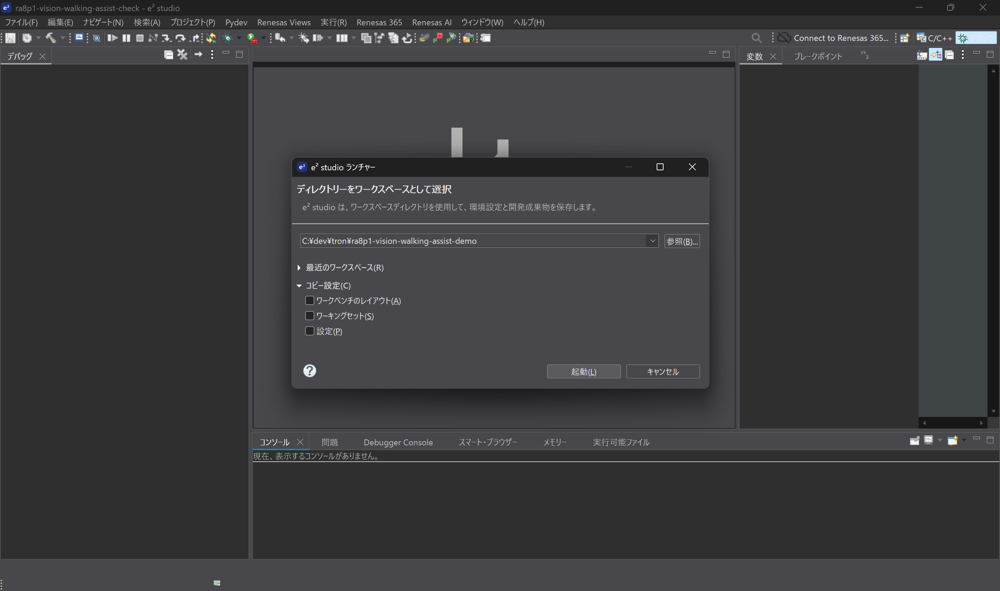

図1：新しいworkspaceの指定。画像の `ra8p1-vision-walking-assist-demo` はIDEの管理領域で、ソースの取得先とは別フォルダです。

### 2.2 既存の3プロジェクトを取り込む

1. `File > Import... > General > Existing Projects into Workspace` を選び、`Next` を押します。
2. `Select root directory` の `Browse...` で、取得先の `firmware/evaluations/` を指定します。
3. 一覧で次の3つを選択します。

   - `mtkernel_test7_dualCoreIpc`（CPU0）
   - `mtkernel_test7_dualCoreIpc_CPU1`（CPU1）
   - `mtkernel_test7_dualCoreIpc_Solution`（Solution）

4. `Copy projects into workspace` は選択せず、`Finish` を押します。取得先の相対配置を維持したまま、Project Explorerに3つの名前が並びます。
5. CPU0とCPU1をそれぞれ右クリックし、`Build Configurations > Set Active > Debug` を選択します。既にDebugなら変更不要です。

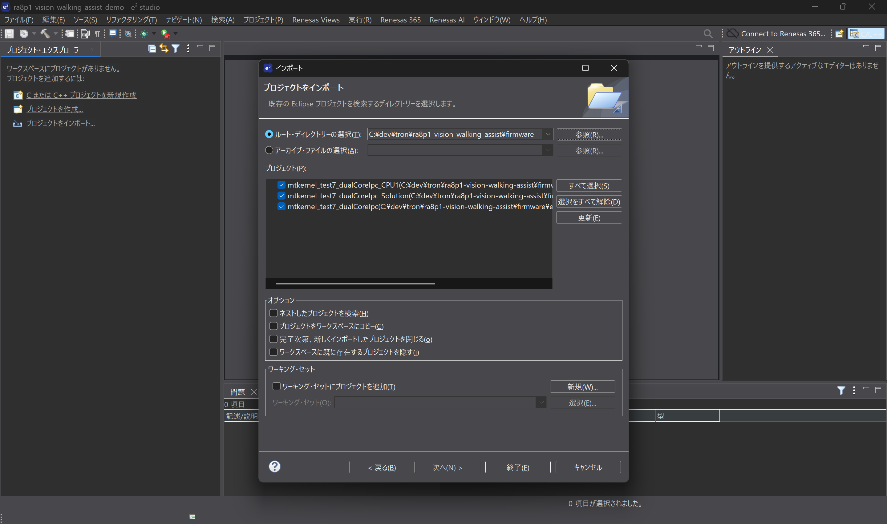

図2：3プロジェクトを選択し、「プロジェクトをワークスペースにコピー」はオフにします。撮影例では一階層上の `firmware/` から同じ3件を検出しています。

<details>
<summary>インポート項目・Debug構成の画面</summary>

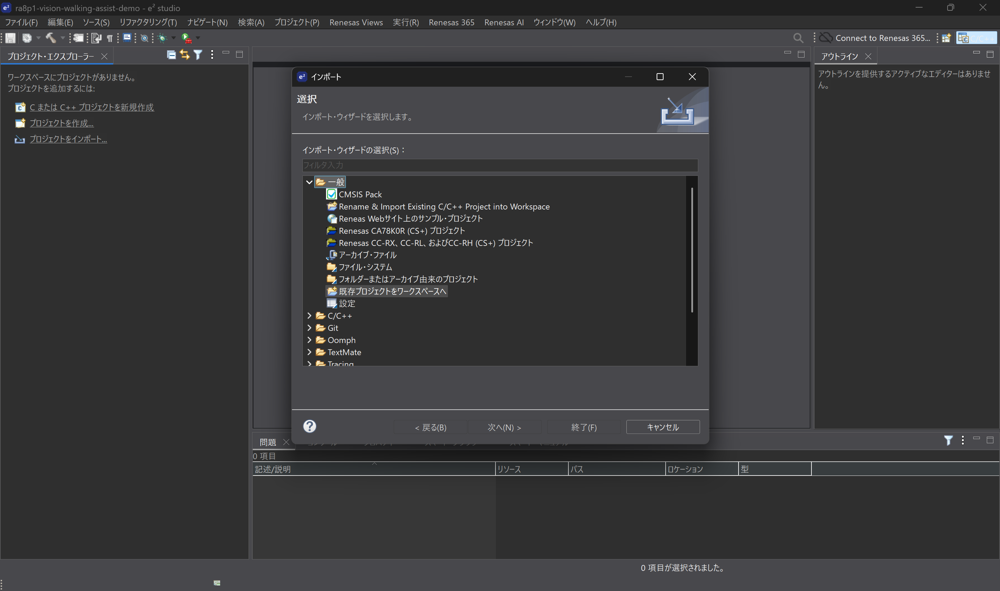

「一般 > 既存プロジェクトをワークスペースへ」を選択します。

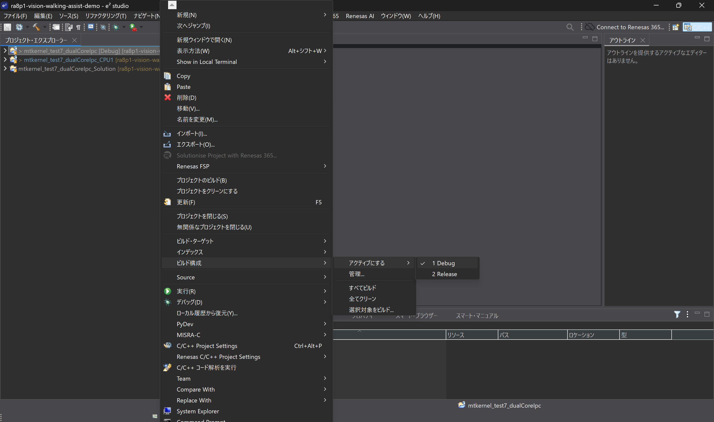

両CPUで「ビルド構成 > アクティブにする > Debug」を使用します。

</details>

### 2.3 Solutionからビルドする

新規取り込み直後はCleanを行わず、以下の通常ビルドを実行します。一度ビルドした後にコード・ヘッダ設定を変更した場合は、2.4節のクリーンビルドを使用します。

1. Project Explorerで **`mtkernel_test7_dualCoreIpc_Solution` というプロジェクト名**を右クリックし、**`Build Project`** を選択します。関連するCPU0・CPU1もビルドされます。
2. Consoleで両CPUのビルド完了とエラーがないことを確認します。片方の結果しか表示されない場合は、Consoleの表示対象を切り替えます。
3. CPU0の `Debug/mtkernel_test7_dualCoreIpc.elf` とCPU1の `Debug/mtkernel_test7_dualCoreIpc_CPU1.elf` が生成されたことを確認します。

**この操作で `solution.xml` や `configuration.xml` を開く必要はありません。`Build Project` と `Generate Project Content` は別の操作です。本手順では `Generate Project Content` を押しません。**

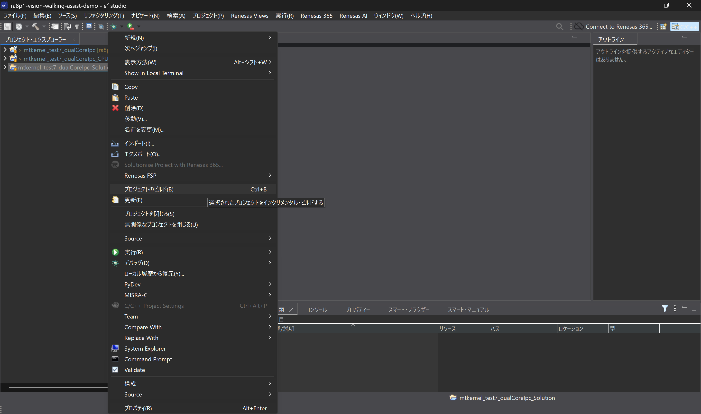

図3：Solutionを右クリックし、「プロジェクトのビルド」を選択します。

2026-09-28の記録はCPU0が0 errors / 17 warnings、CPU1が0 errors / 106 warningsでELF生成まで完了しています。[全文ログと完了画面](evidence/baseline-verification.md#2026-09-28の手順実行記録)を参照してください。初回Cleanで `No rule to make target 'clean'` が出た場合も、その後の通常ビルドの完了結果を確認します。通常ビルド自体がエラーで終わった場合は書込みへ進みません。

同梱の `ra/`、`ra_gen/`、`ra_cfg/`、`mtk3_bsp2/` と変換済みモデルをそのまま使用します。モデル再変換も不要です。`Debug/` にはリンカ・デバッグ入力もあるため、フォルダ全体を削除しないでください。

参照：[CPU0 .cproject][project0]、[CPU1 .cproject][project1]、[Solution設定][solution-config]。操作の根拠：[Renesas公式の既存プロジェクト取り込み・Solutionビルド手順](https://renesas.github.io/fsp/_s_t_a_r_t__d_e_v.html)。

### 2.4 コード・設定変更後のクリーンビルド

変更前の中間生成物を残さないため、本手順ではコード・ヘッダ設定の変更後に **保存 → 両CPUをClean → Solutionをビルド → 両CPUを再ロード** します。

1. 変更したファイルをすべて保存し、実行中のデバッグセッションを終了します。
2. `Project > Clean...`（「プロジェクト > クリーン」）を開き、対象をCPU0の `mtkernel_test7_dualCoreIpc` とCPU1の `mtkernel_test7_dualCoreIpc_CPU1` の2件に限定してCleanします。`Start a build immediately`（クリーン後すぐにビルド）の項目がある場合はオフにします。
3. 両CPUのCleanが正常終了したら、2.3節の手順でSolutionを `Build Project` し、両CPUのビルド完了・エラーなし・ELF生成を確認します。
4. 3章の手順で両CPUを再ロードして起動します。停止中の旧プログラムをResumeするだけでは変更は反映されません。

変更後のCleanがエラーになった場合は、その原因を解消してから進みます。初回Cleanの記録とは区別してください。Cleanの代わりに `Debug/` フォルダ全体を手動削除したり、`Generate Project Content` を実行したりしません。

## 3. 書込み・起動

1. Tera Termを開きます。前回のデバッグセッションを終了し、通常評価では手動追加した診断用breakpointを無効にします。起動設定による `main` 停止は別に扱います。
2. `Run > Debug Configurations`（「実行 > デバッグの構成」）のLaunch Groupから **`mtkernel_test7_dualCoreIpc_CPU1 Debug_Multicore Launch Group`** を選び、`Debug` を押します。
3. 初回に「パースペクティブ切り替えの確認」が出たら **「切り替え」** を押します。「常にこの設定を使用する」は任意です。これはデバッグ用の画面配置への切り替えであり、プログラムの生成・変更ではありません。
4. 両CPUのイメージのロードが完了するまで待ちます。CPU0が `main` で停止したら、Debugビューで **`mtkernel_test7_dualCoreIpc.elf` 配下の停止中スレッド**を選び、**Resume（再開、F8）** を押します。
5. **ロード完了後にボードRESETを押します。** 起動・RESETに伴いCPU1が `Reset_Handler` で停止した場合は、**`mtkernel_test7_dualCoreIpc_CPU1.elf` 配下の停止中スレッド**を選び、同様にResumeします。CPU0も停止していれば再開し、両方が `Running` になったことを確認します。
6. `[BOOT]`、入力到達後のLED同期点灯と `[SYNC]`、続く `[GUIDANCE]` を確認します。Display ONでは映像も更新されます。

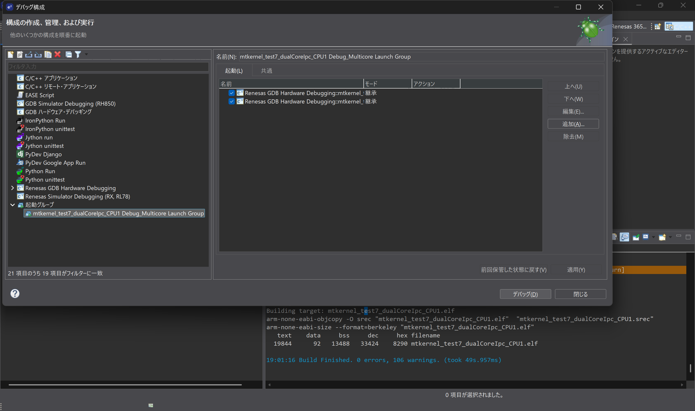

図4：既存のマルチコアLaunch Groupを起動します。

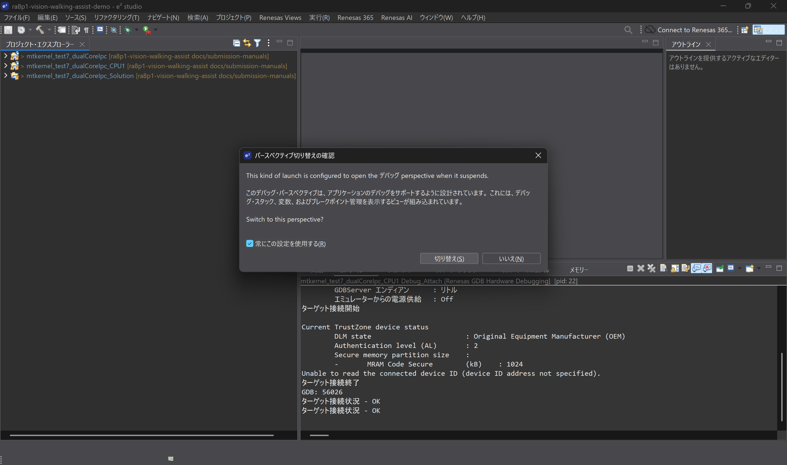

図5：初回の確認画面では「切り替え」を選びます。

<details>
<summary>自動停止したコアをResumeする</summary>

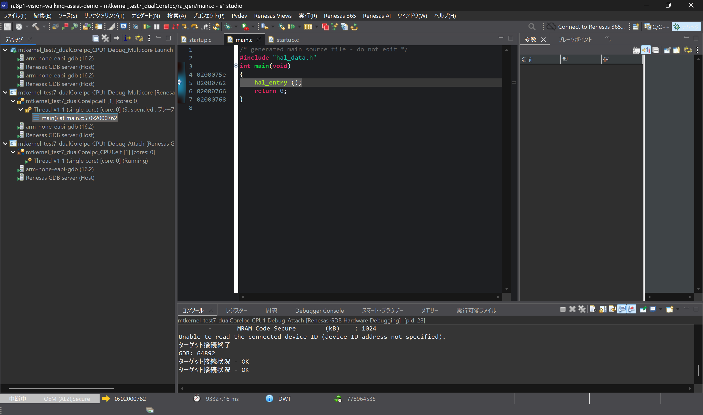

図6：CPU0が `main.c:5` で停止した例。CPU0のスレッドを選択してF8を押します。

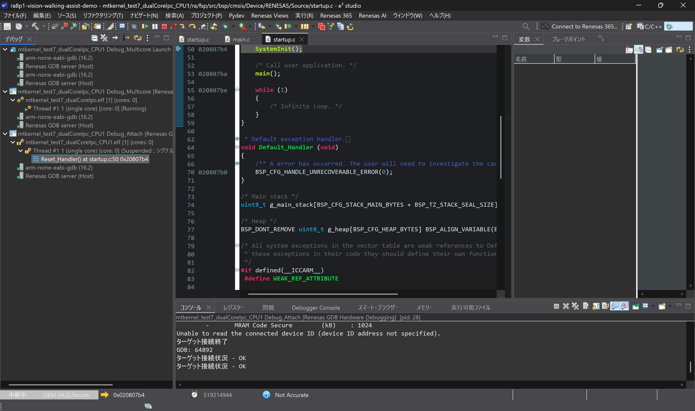

図7：CPU1が `startup.c:50` の `Reset_Handler` で停止した例。CPU1のスレッドを選択してF8を押します。

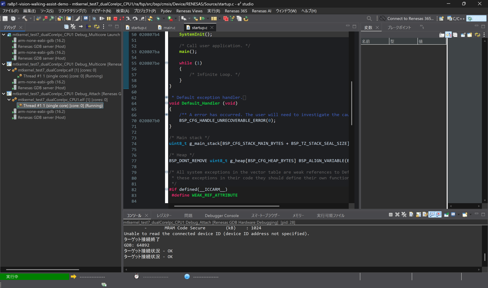

図8：再開後は、エディターに起動コードが表示されたままでも、Debugビューの両スレッドが `Running` なら実行中です。

</details>

CPU0の `main` 停止は同梱launchの停止設定によるものです。一方、図7のCPU1は「シグナル」による停止と表示されています。この2つを区別し、画面に合わせて対象コアを再開します。起動・RESET直後の上記停止と異なり、通常運転中に例外で繰り返し停止する場合は、Resumeを繰り返さず停止位置と原因を調べます。

Launch Group内の `Debug_Multicore` がCPU0とCPU1のイメージをロードし、`Debug_Attach` がCPU1へ接続します。Attachを手動で追加する必要はありません。ロード中のRESETは行いません。

参照：[Launch Group][launch]、[Multicoreロード設定][launch-multi]。

## 4. カメラ・USB・Displayの選択

[共通設定 app_demo_config.h][demo-config]を変更した場合も、2.4節に従って **保存 → 両CPUをClean → Solutionをビルド → 両CPUを再ロード** します。

| 設定 | 初期値 | 選択 |
| --- | --- | --- |
| `APP_VIDEO_SOURCE_CAMERA` | `1U` | 1：カメラ、0：USB動画 |
| `APP_ENABLE_DEBUG_DISPLAY` | `1U` | 1：Display ON、0：OFF |

起動ログ `[BOOT] input=CAMERA display=ON uart=CPU1` に設定が表示されます。これは設定表示であり、周辺機器の初期化成功通知ではありません。

USBでは[同梱入力セット][usb-assets]から `SELECT.TXT` と `VID001.Y56` をUSBメモリのルートへコピーします。動画の帰属表示として [USB-VIDEO-NOTICE.txt](licenses/USB-VIDEO-NOTICE.txt) も同じ場所へコピーします。SELECTの内容は次の2整数です。

```text
001
10
```

これは動画001・目標10 FPSを指定します。動画番号は0～999、FPSは0～120で、0は速度制限なしです。同梱動画は000～013です。`USB_TEST.TXT` は再生に必須ではありません。

同梱動画は[出典記載の市街地歩行映像](THIRD_PARTY_SOFTWARE.md#評価用動画)を10 FPSにし、30秒ごとに分割して224×168・RGB565へ変換したものです。Y56はヘッダなし、1フレーム75,264 byteの連続データで、音声を含みません。000～012は各300フレーム（10 FPSで30秒）、013は最後の76フレーム（同7.6秒）です。再変換は不要です。MP4の拡張子を変更したファイルは使用できません。

USBのFPS制御はDisplay ON/OFFの双方で適用します。処理が追い付かない場合、指定FPSより遅くなります。再生終了後は**入力USB**の取り外し・再挿入で再生します。再挿入では起動同期を繰り返しません。

参照：[USB loader][usb-loader]、[映像バッファ][video-source]。

## 5. 表示の読み方

LCDには入力映像を448×336へ拡大し、緑枠で物体検出、青枠で活動量、赤の始点と黄の線で動きベクトルを重ねます。物体認識は非同期で、最新の完了結果を表示します。

`imgL/imgR` は入力画像の左右半分の活動量です。初期設定 `swap=0` では、活動量が大きい側をデモ上の危険側、その反対を回避方向とします。物体検出の確率や障害物までの距離ではありません。左右は画像座標なので、カメラの向きや反転した素材によって実空間との対応が変わります。

| 出力 | 意味 |
| --- | --- |
| LED1・青 / `risk=NONE` | 低活動。危険提示なし。安全の保証ではない |
| LED2・緑 / `risk=POSSIBLE` | 中程度の活動量による注意提示 |
| LED3・赤 / `risk=HIGH` | 高い活動量による強い注意提示 |
| LED6・アンバー | 左へ回避する方向指令 |
| LED7・黄 | 右へ回避する方向指令 |
| `danger=UNKNOWN GVS direction=NONE` | 方向を提示しない。無効・不確実・更新停止では危険度LEDも消灯 |

左右差が小さいときは方向LEDのみ消灯し、活動量に応じた危険度表示を続けます。起動同期はLED1～3の同時点灯を2回行う特別なパターンで、その間の方向LEDは消灯します。

ログの形式例（測定結果ではありません）：

```text
[BOOT] input=USB display=ON uart=CPU1
[SYNC] event=2 seq=1 t=2340 pattern=ALL_2
[GUIDANCE] event=12 seq=200 danger=LEFT GVS direction=to RIGHT | risk=POSSIBLE imgL=98 imgR=50 t=9000 reason=ACTIVITY objects=1 sem=190 swap=0
```

`danger` は危険側、`GVS direction=to ...` は回避方向です。GVSの表示は論理指令であり、人体刺激は行いません。`event` はLEDとログで共有する判定イベント、`seq` はsnapshot番号、`t` はCPU1の判定時刻（起動後ms）です。`objects/sem` は最新の物体数・認識対象フレーム番号を表します。

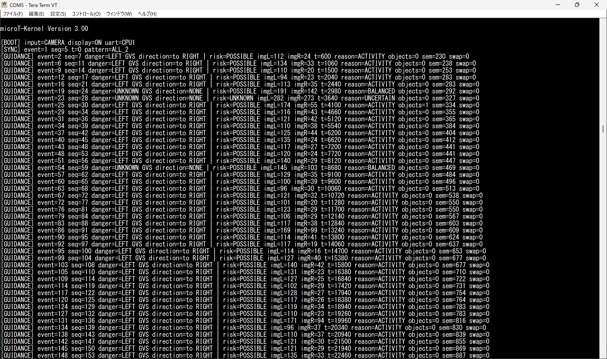

図9：実行時のコンソール。`BOOT` → `SYNC` → `GUIDANCE` の順に出力され、`danger=LEFT` に対して `GVS direction=to RIGHT` が提示されています。`BALANCED`・`UNCERTAIN` では方向が `NONE` になります。この画像はカメラ入力・Display ONの記録です。

閾値は [gvd_config.h][guidance-config] に集約しています。活動量の大きい側が64未満なら低活動、256以上ならHIGH。方向には左右差32以上かつ左右合計の25%以上を要求します。500 ms更新がなければ方向を解除します。これらはデモ用設定で、物理的な危険度の校正値ではありません。

参照：[方向判定][policy]、[LED出力][output]、[ログ][guidance-log]、[Display][display]。

## 6. 評価方法

以下は機能を確かめる操作と期待動作です。実施済みの確認範囲は[実機確認記録](evidence/baseline-verification.md)に分けています。

| 操作 | 期待する動作 |
| --- | --- |
| 起動後、入力を開始 | LED1～3の同期点灯、`SYNC`、`GUIDANCE` の順 |
| 画像左側で十分な動きを作る | `danger=LEFT`、`to RIGHT`、LED7。右側は反対 |
| 静止する / 左右同程度に動かす | `LOW_ACTIVITY` / `BALANCED`、方向LED消灯 |
| USB再生を終了し、500 ms以上待つ | `STALE`、方向・危険度LED消灯 |
| COCO対象物（椅子など）を映す | 検出時に緑枠、`objects/sem` の更新 |
| USB終了後に入力USBを再挿入 | 動画と解析・提示の再開 |
| Display OFFで同じUSBを再生 | 表示なしで解析・提示とFPS制御が継続 |

通常ログは最大約2 Hzです。ログ行数を処理FPSに換算しません。診断用の `[Motion][CP1/CP2]` は処理チェックポイントで、CPU番号ではありません。`[Perception]` は統合結果、`[FPS]` はDisplay側の頻度です。Camera取得・Motion更新・NPU処理時間とは区別します。

動作が止まった場合は、まずDebugビューで両CPUがRunningかを確認します。USB割込み設定関数のbreakpoint停止はフリーズではありません。再起動は3章の手順を使用します。本評価は映像解析と提示の動作を対象とし、実歩行での安全性・危険回避効果の評価とは区別します。

[config0]: ../firmware/evaluations/mtkernel_test7_dualCoreIpc/configuration.xml
[fsp-version]: ../firmware/evaluations/mtkernel_test7_dualCoreIpc/ra/fsp/inc/fsp_version.h
[bsp-guide]: ../firmware/evaluations/mtkernel_test7_dualCoreIpc/mtk3_bsp2/doc/bsp2_ra_fsp_jp.md
[project0]: ../firmware/evaluations/mtkernel_test7_dualCoreIpc/.cproject
[project1]: ../firmware/evaluations/mtkernel_test7_dualCoreIpc_CPU1/.cproject
[solution-config]: ../firmware/evaluations/mtkernel_test7_dualCoreIpc_Solution/solution.xml
[launch]: <../firmware/evaluations/mtkernel_test7_dualCoreIpc_CPU1/mtkernel_test7_dualCoreIpc_CPU1 Debug_Multicore Launch Group.launch>
[launch-multi]: <../firmware/evaluations/mtkernel_test7_dualCoreIpc_CPU1/mtkernel_test7_dualCoreIpc_CPU1 Debug_Multicore.launch>
[demo-config]: ../firmware/evaluations/mtkernel_test7_dualCoreIpc_Solution/Common/app_demo_config.h
[usb-assets]: ../firmware/evaluations/mtkernel_test7_dualCoreIpc/Application/assets/wikipedia/
[usb-loader]: ../firmware/evaluations/mtkernel_test7_dualCoreIpc/Application/usb_loader.c
[video-source]: ../firmware/evaluations/mtkernel_test7_dualCoreIpc/Application/video_source.c
[guidance-config]: ../firmware/evaluations/mtkernel_test7_dualCoreIpc_CPU1/Application/gvd_config.h
[policy]: ../firmware/evaluations/mtkernel_test7_dualCoreIpc_CPU1/Application/gvd_policy.c
[output]: ../firmware/evaluations/mtkernel_test7_dualCoreIpc_CPU1/Application/gvd_output.c
[guidance-log]: ../firmware/evaluations/mtkernel_test7_dualCoreIpc_CPU1/Application/gvd_log.c
[display]: ../firmware/evaluations/mtkernel_test7_dualCoreIpc/Application/display_task.c
