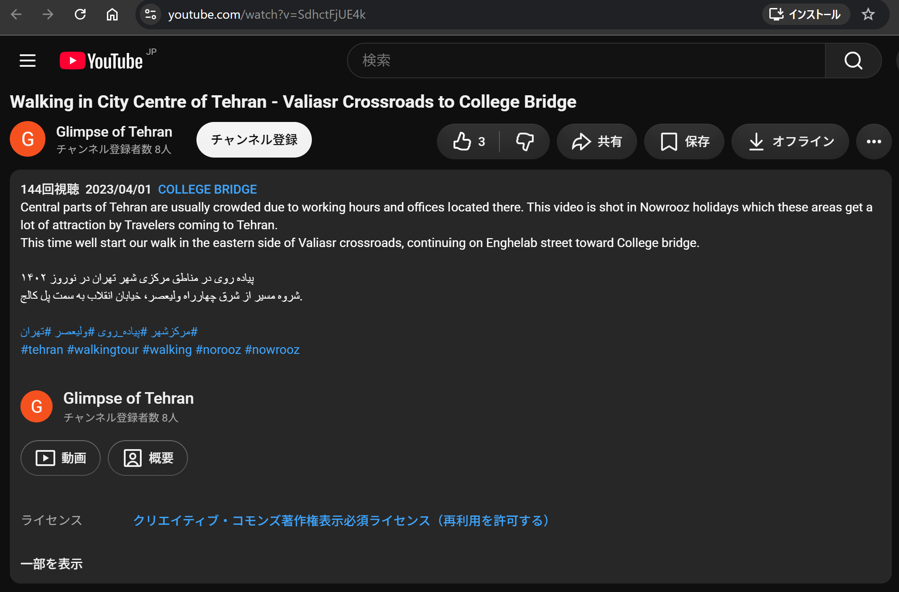

# 第三者ソフトウェア

本作品は以下のOS・HAL・ライブラリ・モデルを利用します。ソースと変換済みモデルはリポジトリに同梱し、通常のビルドで個別取得やモデル変換は行いません。改変箇所は[ファームウェア差分](FIRMWARE_CHANGES.md)にまとめています。

以下の配置は `firmware/evaluations/` を基点とし、CPU0を `mtkernel_test7_dualCoreIpc`、CPU1を `mtkernel_test7_dualCoreIpc_CPU1` と表記します。

## OS・ドライバ・ライブラリ

| 名称・版 / 主な著作権表示 | 用途・同梱位置 | 入手先・ライセンス |
| --- | --- | --- |
| μT-Kernel 3.0（OSヘッダ3.00.01）/ BSP2。Ken Sakamura | 両CPUのタスク・割込み・ボード移植。各 `mtk3_bsp2/` | [TRON Forum BSP2](https://github.com/tron-forum/mtk3_bsp2)、[OS](https://github.com/tron-forum/mtkernel_3)。[T-License 2.2原文][t-license] |
| Renesas FSP 6.5.1。Renesas Electronics Corporation and/or its affiliates | `ra/fsp/`。MIPI/VIN、USB、GLCDC、GPIO、GPT、IPC等 | [FSP 6.5.1](https://github.com/renesas/fsp/tree/v6.5.1)。対象HAL/BSPはBSD-3-Clause。[配布元ライセンス原文](licenses/FSP-6.5.1-LICENSE.md) |
| Arm CMSIS-Core 6.1.0、DSP 1.16.2、NN 7.0.0。Arm Limited and/or its affiliates | `ra/arm/`。CoreとNNヘッダを利用。DSP/NNのSourceはDebugビルド対象外だが同梱 | [CMSIS-Core](https://github.com/ARM-software/CMSIS_6)、[DSP](https://github.com/ARM-software/CMSIS-DSP)、[NN](https://github.com/ARM-software/CMSIS-NN)。[Apache-2.0原文][apache] |
| Ethos-U core driver 25.2.0、Renesasパッケージ版 | CPU0 `ra/npu/ethos-u-core-driver/`。NPU実行 | [Arm配布元](https://gitlab.arm.com/artificial-intelligence/ethos-u/ethos-u-core-driver)、同梱はFSP pack。[Apache-2.0原文][apache] |
| FreeRTOS+FAT V2.3.3。Amazon.com, Inc. or its affiliates | CPU0 `ra/freertos/Lab-Project-FreeRTOS-FAT/`。USB動画のファイル読出し | [配布元](https://github.com/FreeRTOS/Lab-Project-FreeRTOS-FAT)、[MIT原文][fat-license] |
| FreeRTOS V11.1.0の互換ヘッダ。Amazon.com, Inc. or its affiliates | CPU0 `ra/aws/FreeRTOS/FreeRTOS/Source/include/`。FAT/FSPの依存ヘッダ | [FreeRTOS](https://github.com/FreeRTOS/FreeRTOS-Kernel)、[MIT原文を含むヘッダ][freertos-header]。本作品のOSはμT-Kernel |
| Renesasカメラサンプル由来のセンサー/IIC処理（2025年表示） | CPU0 `Application/camera_sensor.*`、`i2c_control.*`。OV5640制御 | [Renesas RAサンプル](https://github.com/renesas/ra-fsp-examples)、[同梱ヘッダ][sensor]のBSD-3-Clause。許諾原文は[Renesas BSD条項](licenses/FSP-6.5.1-LICENSE.md#bsd-3-clause-license) |

FSP・CMSIS等の版は同梱設定とソースに記録された版です。最新リリースへの更新を再現手順に含めません。BSPの導入スナップショットと、FSPの変更ファイルは差分資料で区別しています。

## YOLOX-Tinyと生成実行コード

入手元は [Renesas RUHMI Model ZooのYOLOX-Tiny](https://github.com/renesas/ruhmi-model-zoo/tree/fe7e84ec6823e9abdfd0553361cf20b1c5dbee42/vision/object_detection/yolox_tiny)（commit `fe7e84ec6823e9abdfd0553361cf20b1c5dbee42`）です。CPU0の `Application/yolox_tiny/` に同梱しています。

| 対象 | ライセンス・由来 |
| --- | --- |
| 前後処理などモデル集のソース | Renesas Electronics、BSD-3-Clause。[公式原文の同梱コピー](licenses/RUHMI-MODEL-ZOO-LICENSE.md) |
| YOLOX-Tiny学習済みモデル | 上記配布元はMegvii YOLOX / Apache-2.0と表示。変換スクリプトの取得元は [YOLOX 0.1.1rc0](https://github.com/Megvii-BaseDetection/YOLOX/releases/tag/0.1.1rc0)。[Apache-2.0原文][apache] |
| 生成実行コード | EdgeCortix、Renesas、TensorFlow Authors等の表示を保持。Apache-2.0の記載に加え、対象Renesas製品向け条件を各[ソースヘッダ][model-source]に保持 |

モデルは224×224 INT8入力・COCO 80クラスです。原配布元は生成環境を `mera-2.6.0+pkg.4293` と記載しています。重み・コマンド列・`model.c` は配布元と改行差を除いて一致し、前処理等の4ファイルに統合変更があります。

旧 `Application/ruhmi_inference_code/` とNPU単体試験コードも同梱されていますが、現行Debugのビルド対象外です。それぞれの既存著作権・許諾表示を保持します。

## 評価用動画

CPU0の [Application/assets/wikipedia/][assets] にある `VID000.Y56`～`VID013.Y56` は、次の作品から作成したUSB評価用データです。

| 項目 | 内容 |
| --- | --- |
| 原作品 | [Walking in City Centre of Tehran - Valiasr Crossroads to College Bridge](https://commons.wikimedia.org/wiki/File:Walking_in_City_Centre_of_Tehran_-_Valiasr_Crossroads_to_College_Bridge.webm) |
| 作者・帰属先 | Glimpse of Tehran |
| 入手先 | 上記Wikimedia Commonsファイルページ。原掲載先：[YouTube](https://www.youtube.com/watch?v=SdhctFjUE4k) |
| 出典ページのライセンス表示 | [Creative Commons Attribution 3.0 Unported（CC BY 3.0）](https://creativecommons.org/licenses/by/3.0/) |
| 本作品での加工 | 10 FPS化、30秒ごとの分割（最終区間は残り）、224×168への縮小、ヘッダなしRGB565 `.Y56` 化。音声は使用しない |
| 用途 | 市街地歩行映像を入力とした動き解析・物体検出・方向提示の評価 |

原作品のクレジット、出典とライセンスへのリンク、加工内容を [USB-VIDEO-NOTICE.txt](licenses/USB-VIDEO-NOTICE.txt) にまとめています。動画ファイルをUSBメモリ等へ複製して提供するときは、このNOTICEも添付します。CC BY 3.0は動画に適用するものであり、ファームウェア全体のライセンスではありません。原作者による本作品への支持・推奨を意味しません。

`SELECT.TXT` は再生する動画番号とFPSの設定ファイルです。カメラ評価は動画ファイルを使用せずに実行できます。

原掲載先のライセンス表示（2026-09-28保存）

動画ID `SdhctFjUE4k`、作品名、作者 `Glimpse of Tehran` と再利用を許可するCC表示の保存画面です。[ライセンス欄の拡大記録](assets/licenses/youtube-cc-license-20260928.png)も収録しています。CC BYの版は上記Commons出典の3.0表記に基づきます。この記録は原掲載先の表示を保存したもので、Commonsの外部ライセンス審査の完了を示すものではありません。

## 開発ツール

e² studio、GNU Armツールチェーン、Renesas GDB/J-Link、RDPM、Tera Termは外部インストールする開発・評価ツールです。本リポジトリにツール本体は含めません。

既存のLICENSE/NOTICE・著作権ヘッダを保持し、リポジトリ全体へ単一の新しいライセンスを適用しません。改変箇所の表示は[差分資料](FIRMWARE_CHANGES.md)を参照してください。

[t-license]: ../firmware/evaluations/mtkernel_test7_dualCoreIpc/mtk3_bsp2/mtkernel/docs/TEF000-219-200401.pdf
[apache]: ../firmware/evaluations/mtkernel_test7_dualCoreIpc/ra/arm/CMSIS_6/LICENSE
[fat-license]: ../firmware/evaluations/mtkernel_test7_dualCoreIpc/ra/freertos/Lab-Project-FreeRTOS-FAT/LICENSE.md
[freertos-header]: ../firmware/evaluations/mtkernel_test7_dualCoreIpc/ra/aws/FreeRTOS/FreeRTOS/Source/include/FreeRTOS.h
[sensor]: ../firmware/evaluations/mtkernel_test7_dualCoreIpc/Application/camera_sensor.c
[model-source]: ../firmware/evaluations/mtkernel_test7_dualCoreIpc/Application/yolox_tiny/src_mcu_npu/model.c
[assets]: ../firmware/evaluations/mtkernel_test7_dualCoreIpc/Application/assets/wikipedia/
