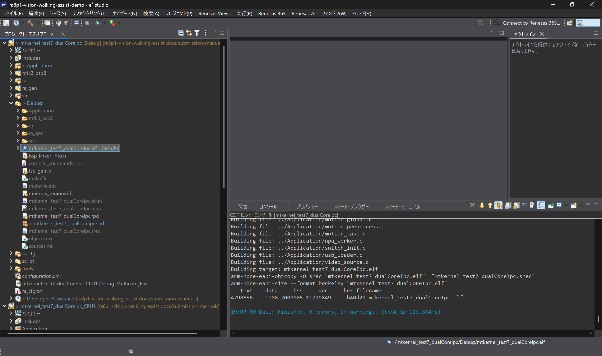
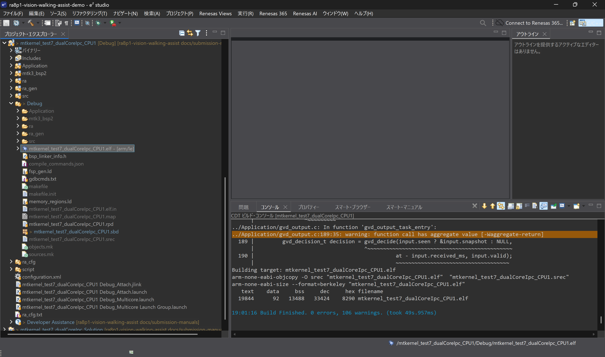
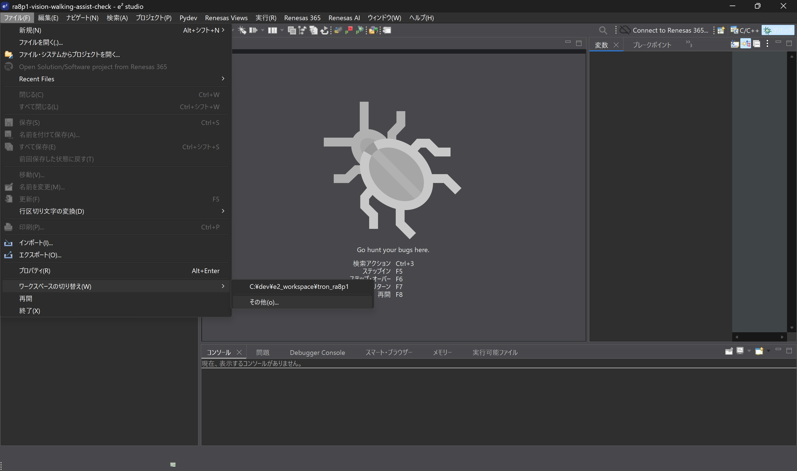
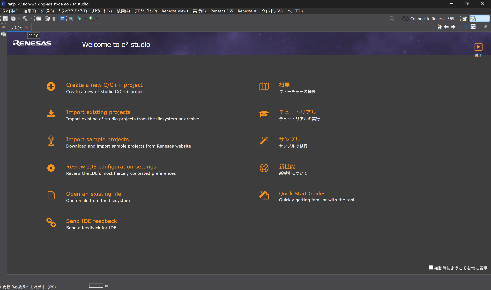
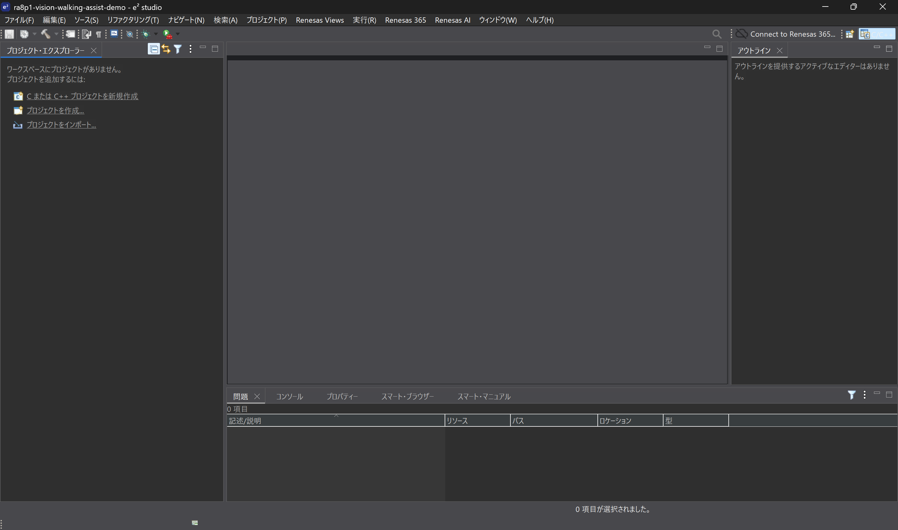
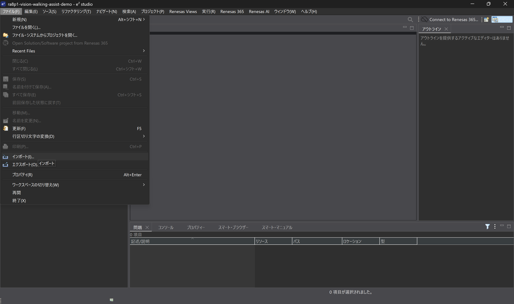
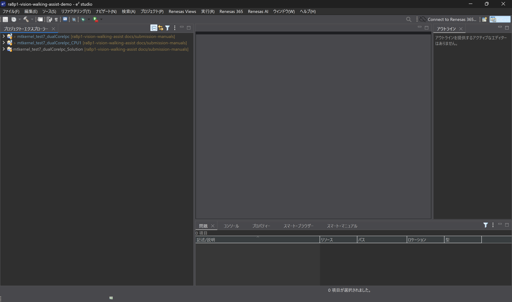
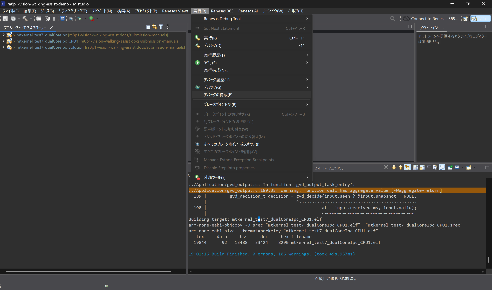
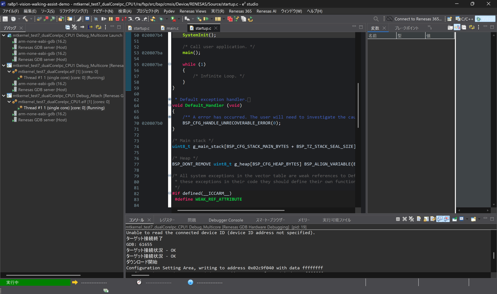

# 実機確認記録

| 項目 | 内容 |
| --- | --- |
| リポジトリ | ra8p1-vision-walking-assist |
| コード基準タグ | `baseline-verified-v1` |
| コミット | `36d0c5eaec646596231edf4f8f1b180e797f5732` |
| 記録の根拠 | 開発時の実機確認報告、下記のビルド全文ログ・操作画面・コンソール画像 |

提出用GitHubから別フォルダへ新規cloneし、新しいe² studio workspaceに取り込んでビルドした。従来のDebug起動→ボードRESETの手順で正常動作を確認し、基準タグをGitHubへ保存した。

この記録の対象は、上記コードと起動手順による動作確認である。性能値・全モードの比較試験・実歩行での安全性評価とは区別する。

左右の対応について、画像左側の動きに対する回避RIGHT・LED7、画像右側に対する回避LEFT・LED6が評価機の構成に適合することも、実機確認報告により記録した。

基準タグ以降の配布整理として、提出用作業ツリーから未使用の `Application/assets/video_data.c`、`video_data.h`、`video_128x72_rgb565.raw` を除外した。この資産整理では実行処理・ビルド設定を変更していない。基準タグと整理後の作業ツリーは区別する。

## 2026-09-28の手順実行記録

新しいworkspace `ra8p1-vision-walking-assist-demo` に提出用リポジトリの3プロジェクトを取り込み、Solutionのビルド、マルチコア起動、パースペクティブ切り替え、停止中コアのResumeとコンソール出力を記録した。今回の画像は `docs/submission-manuals` ブランチの作業ツリーを使用した記録で、上記タグだけを新規cloneした以前の確認とは区別する。

| 対象 | 最終ビルド結果 | 全文ログ |
| --- | --- | --- |
| CPU0 / Debug | 19:00:00完了、0 errors / 17 warnings、ELF・SREC生成 | [CPU0](logs/cpu0-build-20260928.txt) |
| CPU1 / Debug | 19:01:16完了、0 errors / 106 warnings、ELF・SREC生成 | [CPU1](logs/cpu1-build-20260928.txt) |

両ログの先頭には初回Cleanの `No rule to make target 'clean'` / exit code 2があり、その後の通常ビルドで上記成果物が生成されている。全文ログはこの順序と警告を残して収録した。CPU1ログのローカル取得先だけを `[REPO]` に置換し、診断文・数値・行番号は変更していない。CPU0の警告はモデル実行コードのポインター型、CPU1の警告は主にOS/BSP側と方向判定の構造体戻り値に関するもの。

CPU0・CPU1のビルド完了画面

CPU0：0 errors / 17 warnings。

CPU1：0 errors / 106 warnings。

コンソール画像では `input=CAMERA display=ON uart=CPU1`、`SYNC event=1` が最初の `GUIDANCE event=2` に先行すること、左側活動に対する右回避指令、`BALANCED` / `UNCERTAIN` 時の方向解除、`objects=1` の出力を読み取れる。写真にはカメラ・LCDの構成と映像表示が写っている。

- [カメラ・LCD写真](../assets/hardware/ek-ra8p1-camera-lcd.png)
- [Tera Termコンソール](../assets/results/camera-guidance-console.png)
- [CPU0・CPU1のRunning表示](../assets/ide/19-both-cores-running.png)

この撮影記録の対象はカメラ入力・Display ONであり、USB再生・Display OFF・数分間の連続動作の比較記録には使用しない。通常ログの出力頻度から画像処理FPSを算出しない。

資料取り込み時の作業ツリーには、IDEが保存した `.cproject` の改行、`language.settings.xml`、`.sbd` 等の差分も存在する。配布整理ではCPU1 AttachのI/Oレジスター表示用の個人絶対パス1項目を削除し、既存の標準I/Oマップ設定を維持した。ELFのロード先・接続条件・停止条件・アプリケーション処理は変更していない。

補助操作画面（workspace作成からデバッグ接続まで）

「ファイル > ワークスペースの切り替え > その他」。

Welcome画面を閉じる。

取り込み前のProject Explorer。

「ファイル > インポート」。

CPU0・CPU1・Solutionの3件を表示。

「実行 > デバッグの構成」。

接続処理中の画面。書込み完了やアプリケーション動作の判定は、この画面だけでは行わず、ロード完了・両CPUのRunning・実際の出力を使用する。

掲載画像はWindowsタスクバーを除去した。実機写真はPC画面を除いた機器部分を切り出し、ログや画面内の数値は変更していない。`03_debug` と `04_console` の同一コンソール画像は1枚にまとめた。配布用Tera Term INIは記録された通信・端末設定の抜粋で、元INIの接続履歴・個人用パス・SSH設定は含めていない。

実行方法は[実行・評価手順](../RUN_AND_EVALUATE.md)、コードの変更内容は[ファームウェア差分](../FIRMWARE_CHANGES.md)に示す。
